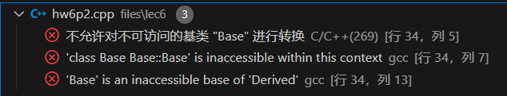
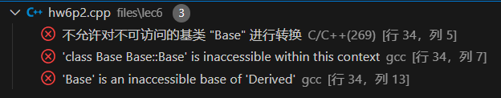
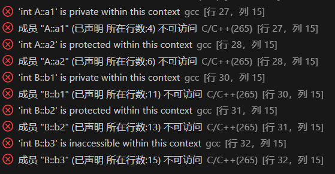

# 计算机程序设计基础(2)
**作业6**
**江玮陶**
**2024年4月4日**
## P510-T4
**Soulution**
```C++
#include<bits/stdc++.h>
using namespace std;
class Person{
    protected:
        char* name;
        char sex;
        int age;
    public:
        Person(char* name, char sex, int age){
            this->name = new char[20];
            strcpy(this->name, name);
            this->sex = sex;
            this->age = age;
        }
};
class Employee :public Person{
    protected:
        int basicSalary;
        int leaveDays;
    public:
        void show(){
            cout<<name<<endl<<sex<<endl<<age<<endl;
            cout<<basicSalary<<endl<<leaveDays<<endl;
        }
        Employee(char* name, char sex, int age, int bS, int lD):Person(name, sex, age){
            basicSalary = bS;
            leaveDays = lD;
        }
};
class Manager :public Employee{
    protected:
        double performance;
    public:
        void show(){
            Employee::show();
            cout<<performance<<endl;
        }
        Manager(char* name, char sex, int age, int bS, int lD, double performance ):Employee(name,sex,age,bS,lD){
            this->performance =performance;
        }
};
int main(){
    char* name;
    name = new char[20];
    char sex;
    int age;
    int bs;
    int ld;
    double per;
    cin>>name;
    cin>>sex>>age>>bs>>ld>>per;
    Manager a(name,sex,age,bs,ld,per);
    a.show();
    delete[] name;
    return 0;
}
```

## P510-T8
>a is 2
b is 3 4
base part of b is3

1. 出现报错

2. 出现报错

## P511-T9

>constructing B1 1
constructing B3 *
constructing B1 2
constructing B3 *
destructing B3
destructing B1
destructing B3
destructing B1

## 附加题
报错信息：

原因： 访问权限错误